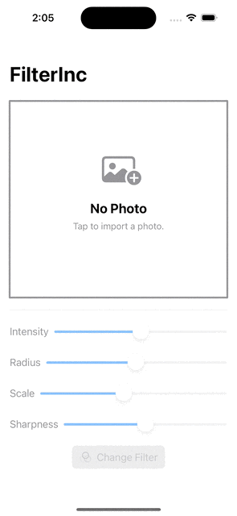

# FilterInc
An iOS app that enables user to import an image from the photo library and choose a filter to apply to the image. The processed image then can be shared using ShareLink. The app will automatically request for an App Store review when the user has tapped the 'Change Filter' button more than 20 times. 
## Featuring
- PhotosPicker
- CoreImage
- StoreKit requestReview()
- ShareLink
- Observable
## App Preview
This demo features the feature/swift-data branch.
*Please wait for the demo GIF to load*

  

## LICENSE

[MIT](LICENSE)
